# Sajilo Sahayata - Disaster Reporting & Coordination System

**From Alert to Action Instantly**

[](https://react.dev/)
[](https://vitejs.dev/)
[](https://nodejs.org/)
[](https://expressjs.com/)
[](https://www.mongodb.com/)
[](https://www.typescriptlang.org/)
[](https://tailwindcss.com/)
[](LICENSE)

---

## Overview

**Sajilo Sahayata** (नेपाली: सजिलो सहायता) is a real-time disaster management platform that connects citizens with local government responders. It minimizes the time gap between incident reporting and official response through automatic location detection, multilingual support, and offline resilience.

When a citizen reports an incident (fire, flood, landslide, accident, etc.) with a photo and GPS location, the system automatically determines the responsible local government unit (GaPa/NaPa) and broadcasts the alert to the relevant admin dashboard. Citizens can view nearby incidents on an interactive map, contact emergency services, and track the status of their reports.

### How It Works

1. **Detect** - The platform automatically detects the user's location and identifies the corresponding local government body.
2. **Report** - Citizens submit incident reports with geolocation and photo evidence, even when offline.
3. **Coordinate** - Admins receive real-time alerts, manage reports, and coordinate response efforts.
4. **Resolve** - Report statuses (pending → verified → working → solved) keep everyone informed.

---

## Features

### Citizen Features

- **Incident Reporting** - Submit reports with live GPS location and photo capture (camera/gallery)
- **SMS & Twilio Integration** - Submit emergency reports via SMS. Supports conversation threading for follow-up details.
- **AI Translation & Image Analysis** - Uses Google Gemini AI to translate multilingual reports (Nepali, Hindi, Maithili, etc.) to English and analyzes attached photos for disaster severity and verification.
- **Offline Queue** - Reports submitted offline are queued in IndexedDB and auto-synced when connectivity returns
- **Interactive Map** - View all incidents clustered on a Leaflet map with color-coded markers by type
- **Emergency Contacts** - Department-specific contacts (Fire, Police, Flood, etc.) cached for offline access
- **Real-Time Alerts** - Push notifications with deep links to the map for urgent incidents broadcast by admins
- **Multi-Language** - Interface available in English, Nepali, Hindi, Bhojpuri, and 5 other local languages
- **Profile Management** - Edit personal details (username, phone, email, address, citizenship ID)

### Admin Features

- **Dashboard** - Data visualizations (charts) for incident analytics
- **Report Management** - View, filter, verify, edit, and resolve reports
- **Two-way SMS** - Reply to SMS reporters directly from the dashboard using Twilio
- **User Management** - View users filtered by location, change roles, delete users
- **Alert Broadcasting** - Create and send alerts with automatic push notifications to all subscribers
- **Contact Management** - CRUD for emergency contact numbers by department and location
- **Safe Zone Management** - Manage safe zones (hospitals, shelters, police stations, fire stations) displayed on the map

### Technical Features

- **PWA** - Installable progressive web app with service worker caching
- **Background Sync** - Pending reports auto-sync via `SyncManager` API even when the tab is closed
- **Map Tile Caching** - CARTO basemap tiles cached for offline map viewing
- **TypeScript Backend** - Full type safety with Express + Mongoose
- **Vite Code Splitting** - Automatic chunk splitting for optimal loading
- **React Lazy Loading** - Route-based code splitting with Suspense

---

## Tech Stack

### Frontend

| Library                        | Purpose                            |
| ------------------------------ | ---------------------------------- |
| **React 18**                   | UI framework                       |
| **Vite 6**                     | Build tool & dev server            |
| **Tailwind CSS v4**            | Utility-first CSS                  |
| **Framer Motion**              | Animations & transitions           |
| **Zustand**                    | State management                   |
| **TanStack React Query**       | Server state & caching             |
| **React Router v7**            | Client-side routing                |
| **i18next**                    | Internationalization (9 languages) |
| **Leaflet / React-Leaflet**    | Interactive maps                   |
| **Chart.js / react-chartjs-2** | Data visualization                 |
| **Axios**                      | HTTP client                        |
| **Lucide React**               | Icons                              |
| **React Hot Toast**            | Toast notifications                |
| **React Helmet Async**         | SEO / meta tags                    |
| **Day.js**                     | Date formatting                    |
| **Canvas Confetti**            | Celebration effects                |
| **Turf.js**                    | Geospatial analysis                |

### Backend

| Library                | Purpose                              |
| ---------------------- | ------------------------------------ |
| **Node.js 18**         | Runtime                              |
| **Express 5**          | HTTP framework                       |
| **TypeScript**         | Type safety                          |
| **Mongoose**           | MongoDB ODM                          |
| **JWT (jsonwebtoken)** | Authentication                       |
| **bcrypt**             | Password hashing                     |
| **Cloudinary**         | Image upload & hosting               |
| **Multer**             | File upload parsing (memory storage) |
| **Turf.js**            | Point-in-polygon (GPS → GaPa/NaPa)   |
| **Cookie Parser**      | Cookie handling                      |
| **CORS**               | Cross-origin support                 |
| **Day.js**             | Date formatting                      |
| **Web Push**           | Push notifications                   |
| **dotenv**             | Environment configuration            |

### Database

- **MongoDB** - Primary database with `2dsphere` geospatial indexes on User, Report, and SafeZone collections

---

## Project Structure

```
sajilo-sahayata/
├── frontend/                  # React PWA
│   ├── public/
│   │   └── sw.js              # Service Worker (cache, push, sync)
│   ├── src/
│   │   ├── Admin/             # Admin panel pages
│   │   ├── Auth/              # Auth guard components
│   │   ├── api/               # Axios instance + interceptors
│   │   ├── components/        # Shared UI components
│   │   ├── data/              # Dummy/fixture data
│   │   ├── hooks/             # Custom React hooks
│   │   ├── layouts/           # Navigation/Admin layouts
│   │   ├── locales/           # i18n translation JSON files (9 langs)
│   │   ├── pages/             # Route-level page components
│   │   ├── routes/            # React Router configuration
│   │   ├── services/          # Firebase, API service
│   │   ├── stores/            # Zustand stores
│   │   ├── utils/             # Offline queue, CSV export
│   │   └── ...config files
│   ├── vercel.json
│   └── vite.config.js
├── backend/                   # Express API
│   ├── src/
│   │   ├── config/            # DB, Cloudinary config
│   │   ├── controllers/       # Route handlers (7 controllers)
│   │   ├── middlewares/       # Auth + admin guards
│   │   ├── models/            # Mongoose schemas (6 models)
│   │   ├── routes/            # Express routers (7 route files)
│   │   ├── utils/             # resolveGaPa helper
│   │   └── main.ts            # Entry point
│   ├── data/geojson/          # GeoJSON boundary files
│   └── ...config files
├── assets/                    # Screenshots, images, logos
└── docs/                      # Architecture & API documentation
```

---

## Screenshots

### Logo

<div style="display: flex; gap: 10px; align-items: center; margin-bottom: 20px;">
  
  
</div>

<details>
  <summary><strong>User View (Tap to Expand)</strong></summary>
  <br />
  <div style="display: flex; flex-wrap: wrap; gap: 10px;">
    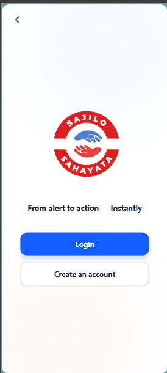
    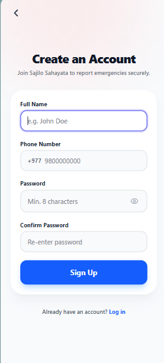
    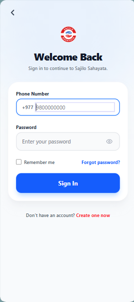
    
    
    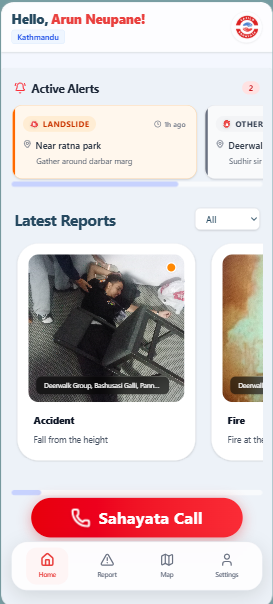
    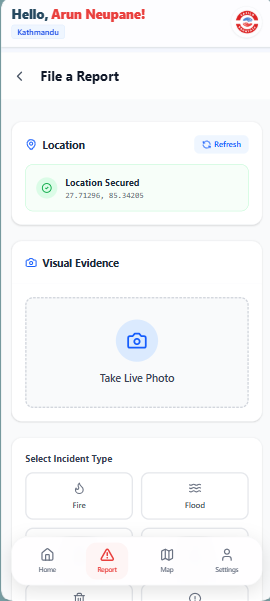
    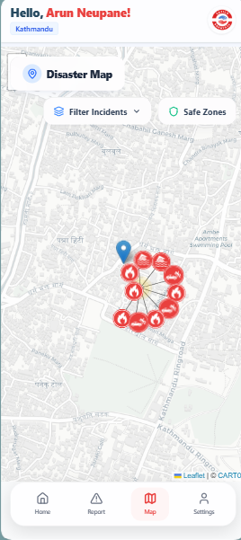
    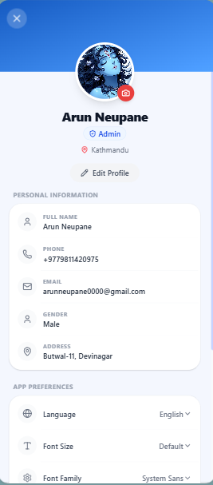
  </div>
</details>

<br />

<details>
  <summary><strong>Admin Panel (Tap to Expand)</strong></summary>
  <br />
  <div style="display: flex; flex-direction: column; gap: 15px;">
    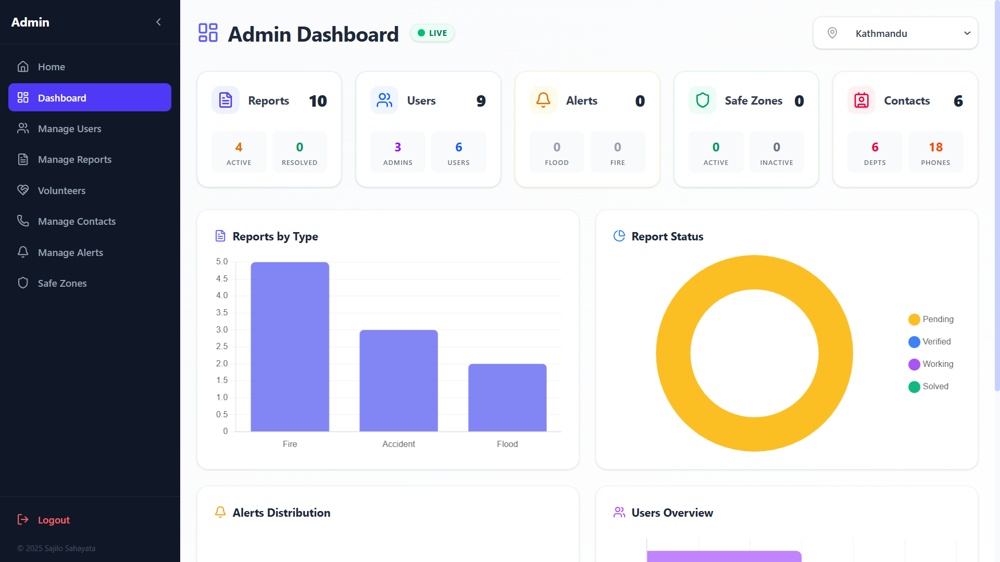
    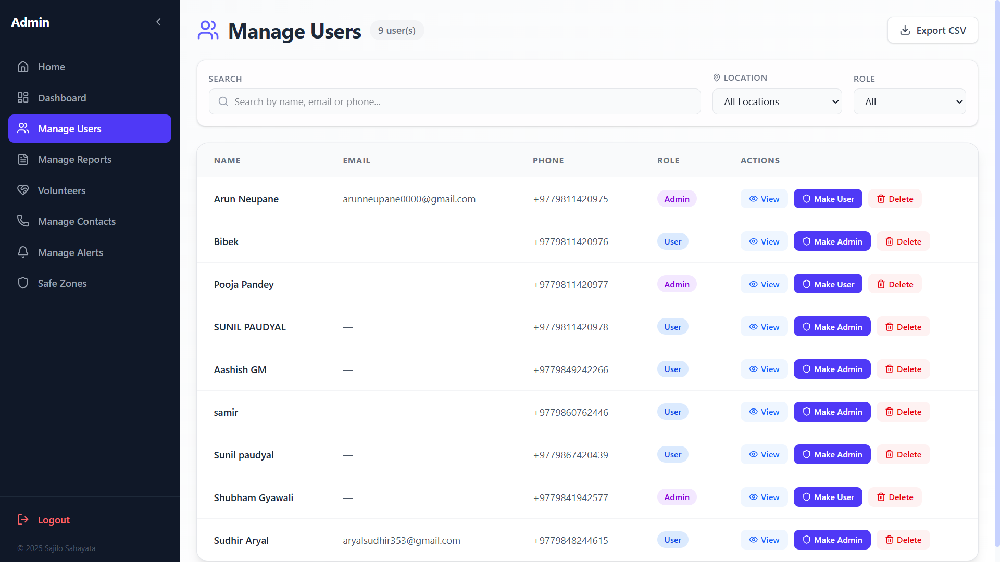
    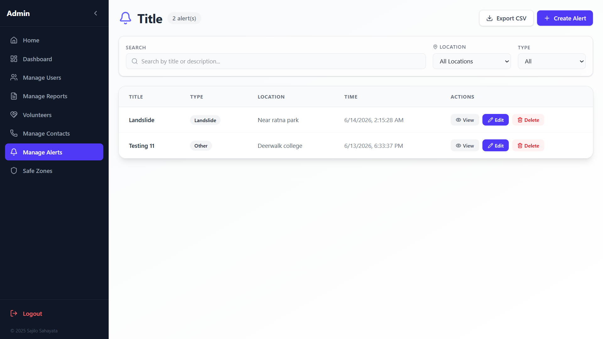
    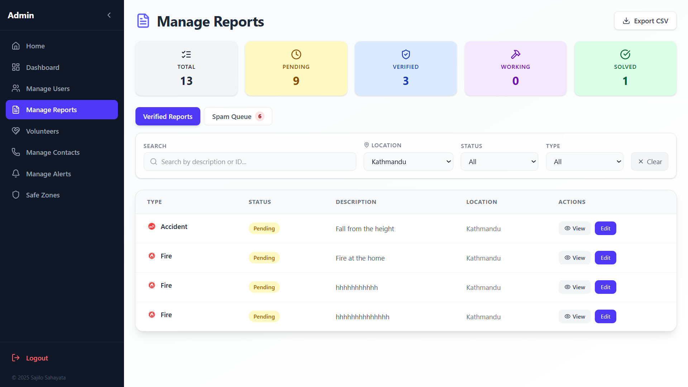
    
  </div>
</details>

---

## Quick Start

### Prerequisites

- Node.js v18+
- MongoDB Atlas URI (or local MongoDB)
- npm v9+

### 1. Clone

```bash
git clone https://github.com/arundada9000/sajilo-sahayata.git
cd sajilo-sahayata
```

### 2. Backend Setup

```bash
cd backend
cp .env.example .env    # Fill in your values
npm install
npm run dev             # Starts on http://localhost:3000
```

Required `.env` variables:

```env
PORT=3000
MONGO_URI=your-mongodb-connection-string
JWT_SECRET=your-secret-key
CLIENT_URL=http://localhost:5173
CLOUDINARY_CLOUD_NAME=...
CLOUDINARY_API_KEY=...
CLOUDINARY_API_SECRET=...
VAPID_PUBLIC_KEY=...
VAPID_PRIVATE_KEY=...
```

### 3. Frontend Setup

```bash
cd frontend
npm install
npm run dev             # Starts on http://localhost:5173
```

Frontend `.env`:

```env
VITE_API_URL=http://localhost:3000/api
VITE_FIREBASE_CONFIG=...
```

---

## Deployment (Vercel)

### Frontend

1. Import the repo in Vercel
2. Framework Preset: **Vite**
3. Root Directory: `frontend`
4. Environment: `VITE_API_URL` pointing to your deployed backend
5. `frontend/vercel.json` handles SPA routing

### Backend

1. Import the repo again as a new project
2. Framework Preset: **Other**
3. Root Directory: `backend`
4. Add all `.env` variables
5. `backend/vercel.json` configures `@vercel/node` to run Express as serverless functions via `src/main.ts`

---

## API Overview

All API routes are prefixed with `/api`.

| Resource       | Base Path         | Key Endpoints                        |
| -------------- | ----------------- | ------------------------------------ |
| **Auth**       | `/api/auth`       | Register, Login, Verify, Profile     |
| **Reports**    | `/api/reports`    | CRUD, Verify, Status change          |
| **Alerts**     | `/api/alerts`     | CRUD with push notifications         |
| **Contacts**   | `/api/contacts`   | CRUD by localGov/department          |
| **Location**   | `/api/location`   | GPS → GaPa detection, available list |
| **Safe Zones** | `/api/safe-zones` | CRUD for safe locations              |
| **Push**       | `/api/push`       | Subscribe, unsubscribe, VAPID key    |

Full API reference: [docs/API.md](docs/API.md)

---

## Project Background

### Team Contributions

#### Initial Prototype - _Team DevNet_

- **Arun Neupane** – Frontend Development | Project Manager
- **Sudhir Aryal** – Presentation | idea formulation | Research
- **Shubham Gyawali** – Backend Development

---

## Changelog

- **v1.3.0 (Latest)** - Added Twilio SMS Reporting, two-way SMS replies from dashboard, Gemini AI image analysis & multilingual text translation (Web + SMS), and Map deep linking for Push Notifications.
- **v1.2.0** - Offline queue with Background Sync, contacts cache, map tile caching, profile editing with backend persistence, fixed signup GaPa detection, Manage Users location filter fix
- **v1.1.0** - UI/UX Overhaul, Admin Polish, Custom SVG Map/Notification Themes, Vercel Serverless Ready
- **v1.0.0** - Initial release (August 2, 2025)

---

## License

This project is developed and maintained by **Arun Neupane** for educational and fair-use purposes. For commercial use or redistribution, please reach out.

---

## Contact

[](https://facebook.com/arundada9000)
[](https://instagram.com/arundada9000)
[](https://wa.me/+9779811420975)
[](mailto:arunneupane0000@gmail.com)
[](https://youtube.com/@code_with_ease)

## Screenshots

### Admin Side

| Dashboard                                                          | Reports                                                           | Alerts                                                           |
| ------------------------------------------------------------------ | ----------------------------------------------------------------- | ---------------------------------------------------------------- |
|  |  |  |

| Users                                                           | Contacts                                                           | Safe Zones                                                           |
| --------------------------------------------------------------- | ------------------------------------------------------------------ | -------------------------------------------------------------------- |
|  | 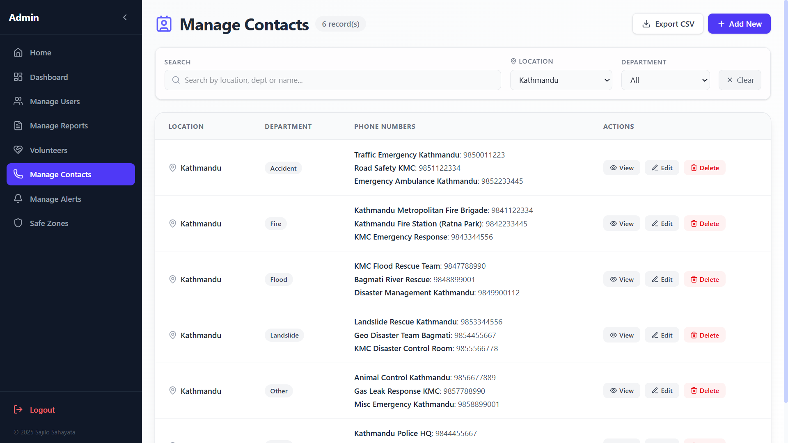 | 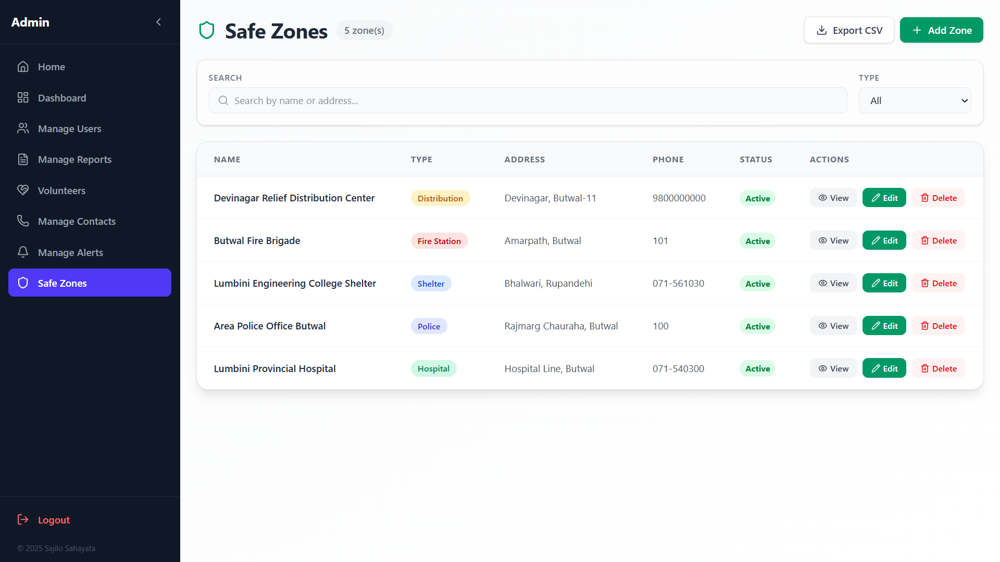 |

| Volunteers                                                           | Home                                                    |
| -------------------------------------------------------------------- | ------------------------------------------------------- |
| 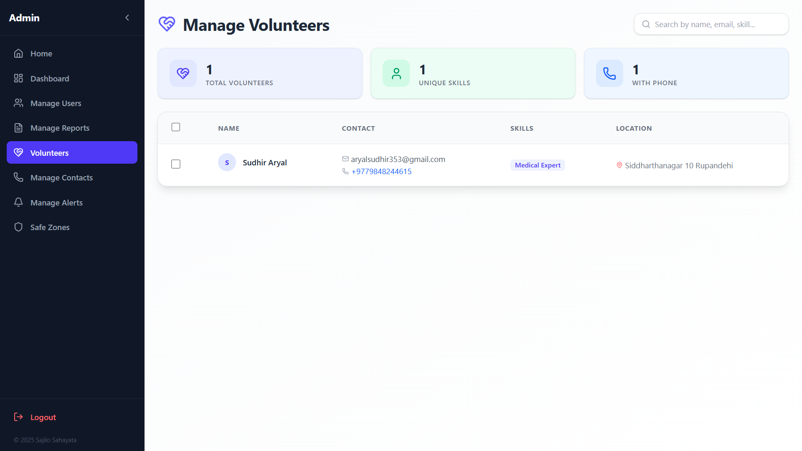 |  |

---

### User Side

| Welcome                                                    | Sign In                                                   | Sign Up                                                   |
| ---------------------------------------------------------- | --------------------------------------------------------- | --------------------------------------------------------- |
|  |  |  |

| Map                                                    | Report                                                    | Profile                                                    |
| ------------------------------------------------------ | --------------------------------------------------------- | ---------------------------------------------------------- |
|  |  |  |

| Emergency Numbers                                          | Sahayata Call                                                    |
| ---------------------------------------------------------- | ---------------------------------------------------------------- |
| 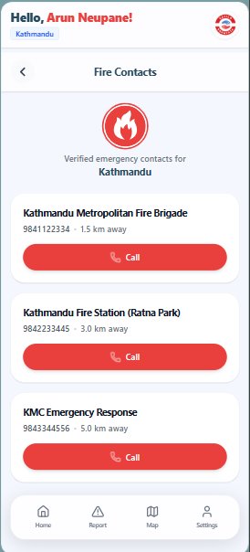 | 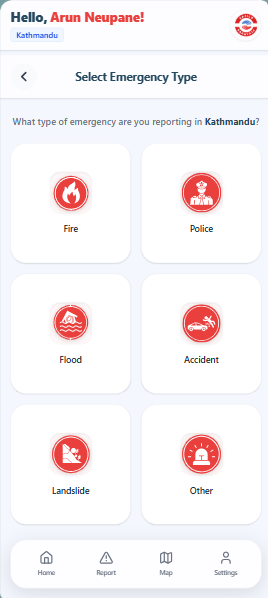 |
